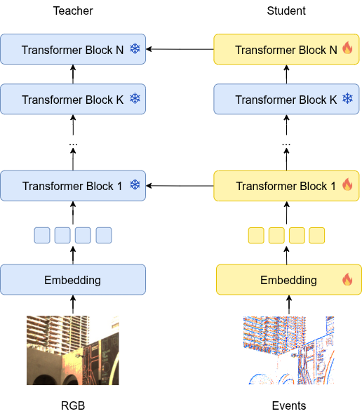
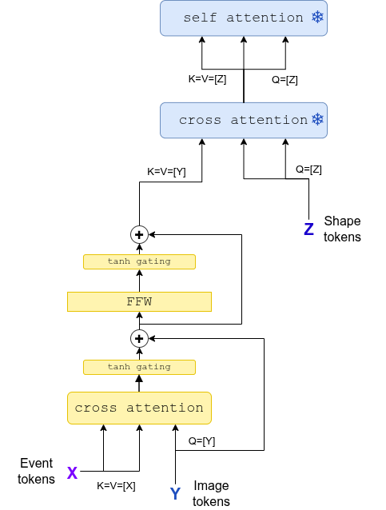

# Event-SAM3D: 3D Object Reconstruction from Event Cameras

## Introduction

SOTA 3D object reconstruction models [1] operate on sharp RGB images and struggle with motion blur [2]. Event cameras are largely blur-free and respond to brightness changes in microsecond resolution. However, the SOTA in 3D reconstruction is built around RGB inputs, and adapting these models to event data is non-trivial due to the scarcity of labeled event data and the absence of established training pipelines.

This project investigates extension of SAM3D to handle a new modality: event image. We train the model in two stages. First, we learn reconstruction of RGB features from events [3]. Freezing the trained encoder in the second stage, we train a fusion module on (blurry RGB, sharp RGB, event image) triplets, asking the model to match object reconstruction from a sharp RGB given a blurry RGB and an event image.

## System Overview

The first stage of the pipeline implements a **teacher-student distillation** framework:

- **Teacher**: Frozen SAM3D RGB encoder processing sharp RGB frames
- **Student**: Trainable event encoder, initialized with RGB encoder's weights

The architecture of this stage is depicted below:



The student receives event images as input and is supervised by the teacher's RGB features at multiple layers [3]. The loss is an L1 distance between RGB and event features, averaged across the selected transformer blocks.

The second stage trains a fusion module between the existing image modalities - RGB, mask, and pointmap - and events. This stage is supervised by the voxel grid reconstruction loss, with the ground truth voxel grid obtained by running SAM3D on a sharp RGB.

### Fusion Modules

Our primary fusion strategy is inspired by the cross-attention approach of [4]:



Zero-initialization of gating parameters allows to stabilize the fusion, steadily updating original inputs over the course of training while not dramatically changing the original representation.

Alternative fusion strategies are implemented in [event_sam3d/models/fusion.py](event_sam3d/models/fusion.py):

| Type | Description |
|------|-------------|
| `gated` | Gated projection fusion — linear projections with a learnable gate over event tokens |
| `attn` | Token fusion transformer with self-attention over concatenated RGB + event tokens |
| `cattn` | Cross-attention variant where event tokens attend to RGB tokens with a learnable weight |

Fusion modules are injected at configurable transformer block indices (default for DinoV2: `[2, 5, 8, 11, 14, 17, 20, 23]`).

### Event Representations

Before fusion, event streams are transformed to an image according to either of these strategies:

- **VoxelGrid**: 3D voxel accumulation over a configurable time window
- **Tencode**: Temporal encoding of events preserving timestamp information

Tencode showed better results in practice, and we used this representation in our experiments.

## Repository Structure

```
event_sam3d/
├── config.py                  # Dataset paths, scene lists, checkpoint dirs
├── datasets/                  # Dataset implementations
│   ├── ie_dataset.py          # Wrapper combining multiple datasets
│   ├── mvsec_ds.py            # MVSEC (real events, HDF5)
│   ├── co3d_ds.py             # CO3D with synthetic events via V2E
│   ├── ereplica_ds.py         # Event Replica with synthetic events
│   ├── obj_ds.py              # Objaverse objects with synthetic events
│   ├── rgbe_ds.py             # RGBE-SEG segmentation dataset
│   └── transforms.py          # Augmentations (flip, crop, wavelet, blur)
├── models/
│   └── fusion.py              # Basic fusion modules: gated, attention, and cross-attention (see the sam3d submodule for the rest)
├── img2event/                 # Training pipeline
│   ├── train.py               # Main training entry point
│   ├── model.py               # TeacherStudent and TeacherStudentReconstruction wrappers
│   ├── model_utils.py         # SAM3D pipeline loading and condition embedder extraction
│   └── utils.py               # Loss functions, model loading, distributed training helpers
└── utils/
    ├── event_utils.py         # Event processing, ETAP-based event tracking
    ├── events_representations.py  # VoxelGrid, Tencode
    ├── events_visualizations.py   # Visualization for event representations
    ├── eval_metrics.py        # Chamfer distance, vIoU, Uni3D similarity
    ├── kpt_utils.py           # Keypoint detection and matching
    ├── pose_metrics.py        # Camera pose evaluation
    └── ...
```

## Datasets

| Dataset | Events | Source | Scenes / Objects |
|---------|--------|--------|-----------------|
| MVSEC | Real | HDF5 | 4 indoor sequences |
| CO3D | Synthetic (V2E) | CO3D-v2 | 18 object categories |
| Objaverse-X | Synthetic (V2E) | Objaverse | 1000+ object types, 4 subtypes per object |
| Event Replica | Synthetic (V2E) | Replica | 7 indoor scenes |
| RGBE-SEG | Real | RGBE-SEG | Multiple scenes, 66K images in total |

Dataset paths and scene lists are configured in [event_sam3d/config.py](event_sam3d/config.py).

## Installation

The package is installable as:

```bash
pip install -r requirements.txt
pip install -e .
```

Additionally, the following submodules should be installed:

- `sam-3d-objects` for the main SAM3D model
- `objaverse-rendering` for rendering Objaverse objects

**Additional third-party packages:**

- [V2E](https://github.com/SensorsINI/v2e?tab=readme-ov-file) for synthetic event generation [5]
- [Uni3D](https://github.com/baaivision/Uni3D) for 3D similarity evaluation

## Training

The main entry point is [event_sam3d/img2event/train.py](event_sam3d/img2event/train.py).

### Basic usage

```bash
python event_sam3d/img2event/train.py \
  --ds_name rgbe \
  --exp_name=eventdino \
  --epochs=200 \
  --batch_size=4 \
  --val_epoch_freq=2 \
  --num_workers=4 \
  --use_wandb \
  --do_save_ckpt \
  --lr 5e-5 \
  --transform_names hflip \
  --block_idxs 2 5 8 11 14 17 20 23
```

Distributed training is supported via `torchrun` and is SLURM-compatible:

```bash
torchrun --nproc_per_node=8 event_sam3d/img2event/train.py ...
```

## Evaluation

Evaluation metrics are implemented in [event_sam3d/utils/eval_metrics.py](event_sam3d/utils/eval_metrics.py):

| Metric | Description |
|--------|-------------|
| Chamfer Distance (CD) | Point cloud distance (CD_P, CD_N, CD average) |
| Volume IoU (vIoU) | Volumetric intersection-over-union for 3D shapes |
| Uni3D Similarity [6] | CLIP-based 3D object similarity score |

## Results

#TBD

## Rendering Pipeline

A Blender-based rendering pipeline ([event_sam3d/rendering/](event_sam3d/rendering/)) generates training data from 3D object assets:

1. Circular camera trajectories are generated around objects with randomizable parameters
2. Synthetic events are generated via V2E from the rendered RGB sequences

## References

1. [SAM3D: Segment Anything in 3D Scenes](https://arxiv.org/abs/2306.03908)
2. [ShapeR: Robust Conditional 3D Shape Generation from Casual Captures](https://arxiv.org/abs/2601.11514)
3. [Segment Any Events via Weighted Adaptation of Pivotal Tokens](https://arxiv.org/abs/2312.16222)
4. [Flamingo: a Visual Language Model for Few-Shot Learning](https://arxiv.org/abs/2204.14198)
5. [v2e: From Video Frames to Realistic DVS Events](https://openaccess.thecvf.com/content/CVPR2021W/EventVision/papers/Hu_v2e_From_Video_Frames_to_Realistic_DVS_Events_CVPRW_2021_paper.pdf)
6. [Uni3D: Exploring Unified 3D Representation at Scale](https://arxiv.org/abs/2310.06773)
7. [Depth AnyEvent: A Cross-Modal Distillation Paradigm for Event-Based Monocular Depth Estimation](https://arxiv.org/abs/2509.15224)