# Event-SAM3D: 3D Object Reconstruction from Event Cameras

## Introduction

SOTA 3D object reconstruction models [1] operate on sharp RGB images and struggle with motion blur [2]. In the example below, SAM3D [1] perfectly reconstructs the objects in the sharp RGB and fails to capture the details in the blurred RGB:

<tr>
<td align="center" colspan="2">
<h4>Reconstruction of selected objects on sharp (left) and blurred (right) samples from the EventReplica dataset that motivates the development of a blur-aware SAM3D</h4>
</td>
</tr>
<tr>
<td align="center">
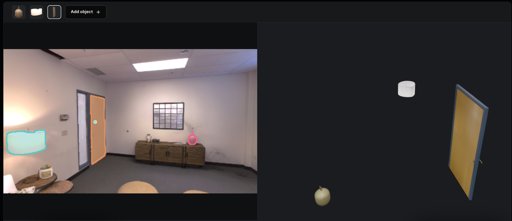
</td>
<td align="center">
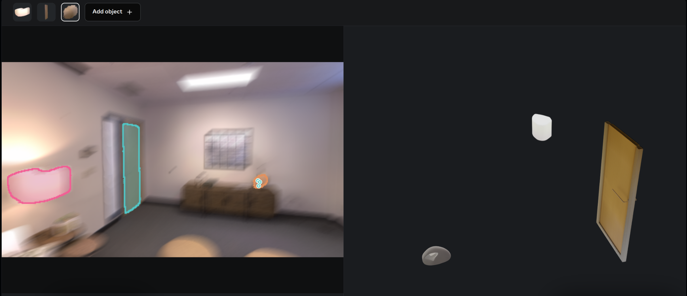
</td>
</tr>

The primary sources of the drop in reconstruction performance are blurred object masks provided by SAM3 and the perceptual complexity of the corresponding image region, which results in less representative image features. The generative model is unable to produce a sharp reconstruction if the input latents it receives from the feature extractors are misleading and insufficient. Therefore, we are seeking a solution that can correct and enhance these features using a modality that is robust to blur.

Event cameras are largely blur-free and respond to brightness changes in microsecond resolution. However, the SOTA in 3D reconstruction is built around RGB inputs, and adapting these models to event data is non-trivial due to the scarcity of labeled event data and the absence of established training pipelines.

This project investigates extending SAM3D to handle a new modality: event images. We train the model in two stages. First, we learn to reconstruct RGB features from events [3]. In the second stage, we freeze the trained encoder and train a fusion module on (blurry RGB, sharp RGB, event image) triplets, asking the model to match object reconstruction from a sharp RGB given a blurry RGB and an event image.

## System Overview

The first stage of the pipeline implements a **teacher-student distillation** framework:

- **Teacher**: Frozen SAM3D RGB encoder processing sharp RGB frames
- **Student**: Trainable event encoder, initialized with RGB encoder's weights

The architecture of this stage is depicted below:


The student receives event images as input and is supervised by the teacher's RGB features at multiple layers [3]. The loss is an L1 distance between RGB and event features, averaged across the selected transformer blocks.

The second stage trains a fusion module between the existing image modalities - RGB, mask, and pointmap - and events. This stage is supervised by the voxel grid reconstruction loss, with the ground truth voxel grid obtained by running SAM3D on a sharp RGB.

### Fusion Modules

Our primary fusion strategy is inspired by the cross-attention approach of [4]:


Zero-initialization of gating parameters stabilizes the fusion, steadily updating the original inputs over the course of training without dramatically altering the original representation.

Alternative fusion strategies are implemented in [event_sam3d/models/fusion.py](event_sam3d/models/fusion.py):

| Type | Description |
|------|-------------|
| `gated` | Gated projection fusion — linear projections with a learnable gate over event tokens |
| `attn` | Token fusion transformer with self-attention over concatenated RGB + event tokens |
| `cattn` | Cross-attention variant where event tokens attend to RGB tokens with a learnable weight |

Fusion modules are injected at configurable transformer block indices (default for DinoV2: `[2, 5, 8, 11, 14, 17, 20, 23]`).

### Event Representations

Before fusion, event streams are transformed into an image using one of the following strategies:

- **VoxelGrid**: 3D voxel accumulation over a configurable time window
- **Tencode**: Temporal encoding of events preserving timestamp information

Tencode showed better results in practice, and we used this representation in our experiments.

## Repository Structure

```
event_sam3d/
├── config.py                  # Dataset paths, scene lists, checkpoint dirs
├── datasets/                  # Dataset implementations
│   ├── ie_dataset.py          # Wrapper combining multiple datasets
│   ├── mvsec_ds.py            # MVSEC (real events, HDF5)
│   ├── co3d_ds.py             # CO3D with synthetic events via V2E
│   ├── ereplica_ds.py         # Event Replica with synthetic events
│   ├── obj_ds.py              # Objaverse objects with synthetic events
│   ├── rgbe_ds.py             # RGBE-SEG segmentation dataset
│   └── transforms.py          # Augmentations (flip, crop, wavelet, blur)
├── models/
│   └── fusion.py              # Basic fusion modules: gated, attention, and cross-attention (see the sam3d submodule for the rest)
├── img2event/                 # Training pipeline
│   ├── train.py               # Main training entry point
│   ├── model.py               # TeacherStudent and TeacherStudentReconstruction wrappers
│   ├── model_utils.py         # SAM3D pipeline loading and condition embedder extraction
│   └── utils.py               # Loss functions, model loading, distributed training helpers
└── utils/
    ├── event_utils.py         # Event processing, ETAP-based event tracking
    ├── events_representations.py  # VoxelGrid, Tencode
    ├── events_visualizations.py   # Visualization for event representations
    ├── eval_metrics.py        # Chamfer distance, vIoU, Uni3D similarity
    ├── kpt_utils.py           # Keypoint detection and matching
    ├── pose_metrics.py        # Camera pose evaluation
    └── ...
```

## Datasets

| Dataset | Events | Source | Scenes / Objects |
|---------|--------|--------|-----------------|
| MVSEC | Real | HDF5 | 4 indoor sequences |
| CO3D | Synthetic (V2E) | CO3D-v2 | 18 object categories |
| Objaverse-X | Synthetic (V2E) | Objaverse | 1000+ objects, 4 variants of each object |
| Event Replica | Synthetic (V2E) | Replica | 7 indoor scenes |
| RGBE-SEG | Real | RGBE-SEG | Multiple scenes, 66K images in total |

Dataset paths and scene lists are configured in [event_sam3d/config.py](event_sam3d/config.py). To generate synthetic datasets, refer to the [Synthesis of event data from RGB frames](#synthesis-of-event-data-from-rgb-frames) section below.

## Installation

The package is installable as:

```bash
pip install -r requirements.txt
pip install -e .
```

Additionally, the following submodules should be initialized via `git submodule update --init --recursive` and installed following the instructions there:

- `sam-3d-objects` for the main SAM3D model
- `objaverse-rendering` for rendering Objaverse objects

**Additional third-party packages:**

- [V2E](https://github.com/kirilllzaitsev/v2e) for synthetic event generation [5]
- [Uni3D](https://github.com/baaivision/Uni3D) for 3D similarity evaluation

## Synthesis of event data from RGB frames

Before generating events, you need to create a dataset with renderings of objects from Objaverse by following the instructions in the `objaverse-rendering` package referenced in this repository.

[V2E](https://github.com/SensorsINI/v2e) is a recent SOTA in synthetic event generation. You can navigate to the `v2e` package and either:

- execute the `run_v2e.py` script for a given dataset and a set of objects
- execute the following command, targeting a single directory with rendered frames:

```
src_dir=dir/with/rendered/images
python v2e.py -i ${src_dir}/images --overwrite --timestamp_resolution=.003 --auto_timestamp_resolution=True --dvs_exposure duration 0.005 --output_folder ${src_dir} --pos_thres=.2 --neg_thres=.2 --sigma_thres=0.03 --dvs_aedat2 events.aedat --output_width=346 --output_height=260 --cutoff_hz=15 --input_frame_rate=30 --no_preview --skip_video_output
```

The script will save an `events.aedat` file that can be parsed via the `event_sam3d/datasets/obj_ds.py`.

Sample visualizations of synthetic events are shown below:

<tr>
<td align="center" colspan="2">
<h4>Training (top) and validation (bottom) batches from the synthetic event dataset with Objaverse objects, with the number of events indicated by the top-left image caption</h4>
</td>
</tr>
<tr>
<td align="center">
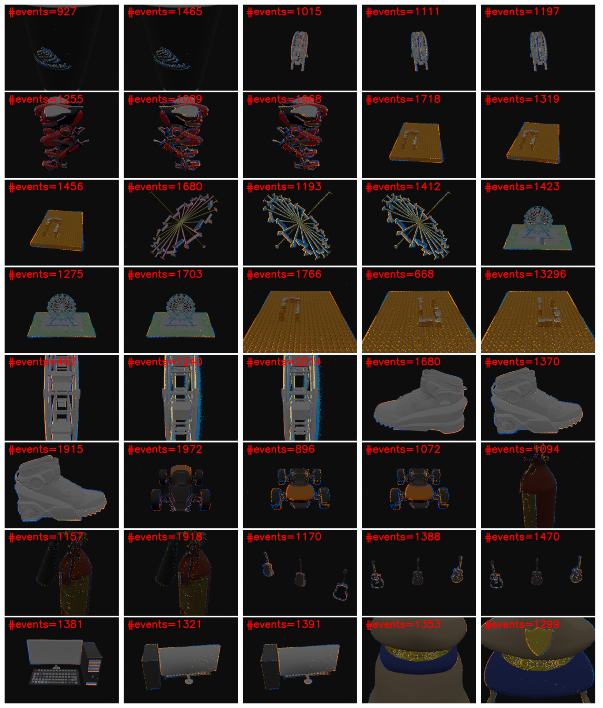
</td>
<td align="center">
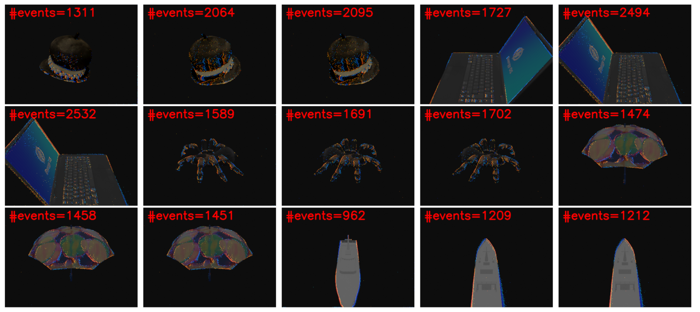
</td>
</tr>

<tr>
<td align="center" colspan="2">
<h4>Synthetically generated events for three Objaverse objects</h4>
</td>
</tr>
<tr>
<td align="center">

</td>
<td align="center">

</td>
<td align="center">

</td>
</tr>

## Training

The main entry point is [event_sam3d/img2event/train.py](event_sam3d/img2event/train.py).

### Basic usage

```bash
python event_sam3d/img2event/train.py \
  --ds_name rgbe \
  --exp_name=eventdino \
  --epochs=200 \
  --batch_size=4 \
  --val_epoch_freq=2 \
  --num_workers=4 \
  --use_wandb \
  --do_save_ckpt \
  --lr 5e-5 \
  --transform_names hflip \
  --block_idxs 2 5 8 11 14 17 20 23
```

Distributed training is supported via `torchrun` and is SLURM-compatible:

```bash
torchrun --nproc_per_node=8 event_sam3d/img2event/train.py ...
```

## Evaluation

Evaluation metrics are implemented in [event_sam3d/utils/eval_metrics.py](event_sam3d/utils/eval_metrics.py):

| Metric | Description |
|--------|-------------|
| Chamfer Distance (CD) | Point cloud distance (CD_P, CD_N, CD average) |
| Volume IoU (vIoU) | Volumetric intersection-over-union for 3D shapes |
| Uni3D Similarity [6] | CLIP-based 3D object similarity score |

For evaluation on synthetic benchmarks, we generate blurry RGB frames by averaging 10, 20, and 40 frames, corresponding to easy, medium, and hard reconstruction complexity, respectively.

<tr>
<td align="center" colspan="2">
<h4>(Blurry RGB, Sharp RGB, Event image) triplets for validation. The blurry RGB is obtained by averaging 40 subsequent sharp frames</h4>
</td>
</tr>
<tr>
<td align="center">
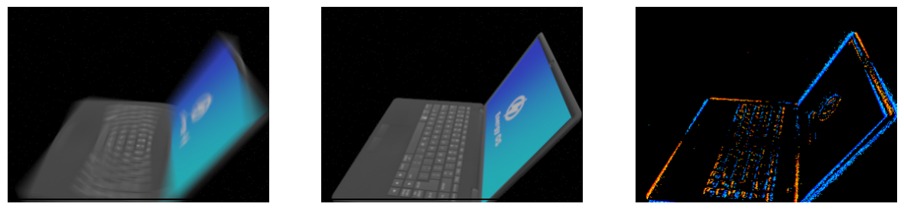
</td>
<td align="center">
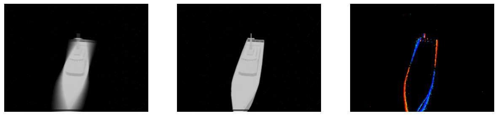
</td>
</tr>

## Qualitative results

Event-SAM3D shows promising results in preserving details despite blur.

The following shows two prediction pairs from the validation split of the MVSEC dataset. Each pair consists of predictions from our model (left) and the original SAM3D (right). Reconstructions from our model closely resemble the actual object with respect to texture detail.

<tr>
<td align="center">
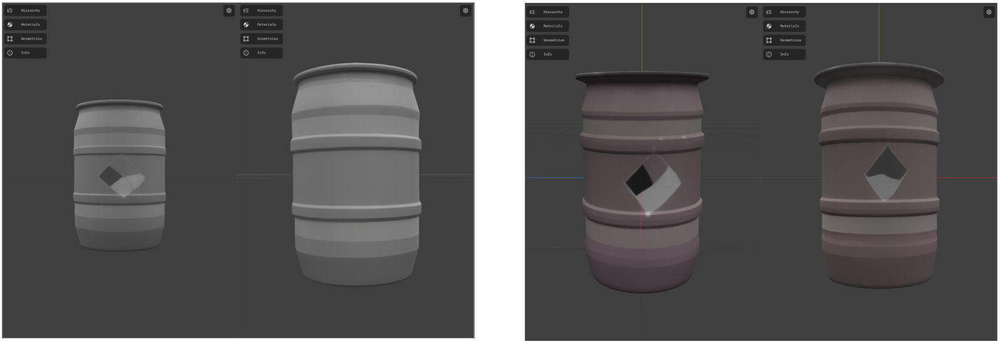
</td>
</tr>

The following input was used for the second pair of reconstructions:

<tr>
<td align="center" colspan="2">
<h4>A sample input with a triplet (RGB, event image, mask) at full resolution and an object-centric crop</h4>
</td>
</tr>
<tr>
<td align="center">
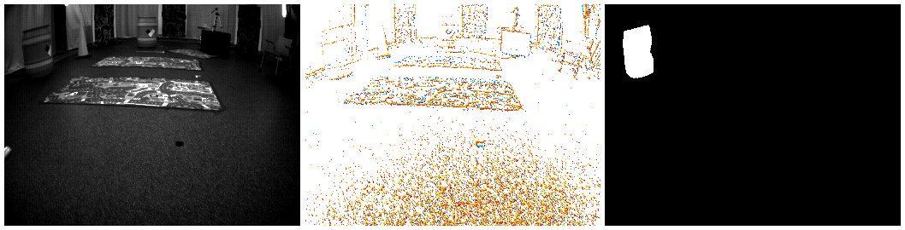
</td>
<td align="center">
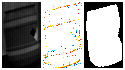
</td>
</tr>

In a more complicated case from the synthetic Objaverse benchmark, the model is able to reconstruct details for large parts of an object while displaying volatility in smaller details:

<tr>
<td align="center" colspan="2">
<h4>A sample of (Sharp RGB, blurry RGB (used as input), final reconstruction) triplets from Objaverse</h4>
</td>
</tr>
<tr>
<td align="center">
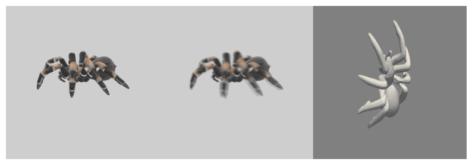
</td>
<td align="center">
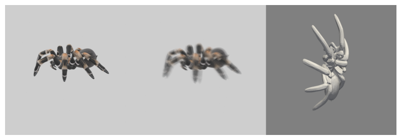
</td>
<td align="center">
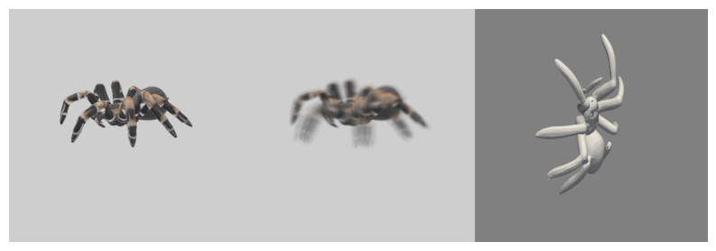
</td>
</tr>

### Attention maps

To analyze representations learned by the event encoder that was trained on the RGBE dataset, we visualize its learned attention maps on a few images from the validation set and compare them to those of the original RGB encoder.

For the RGBE validation set, the attention of the event encoder shows meaningful patterns:

<tr>
<td align="center">
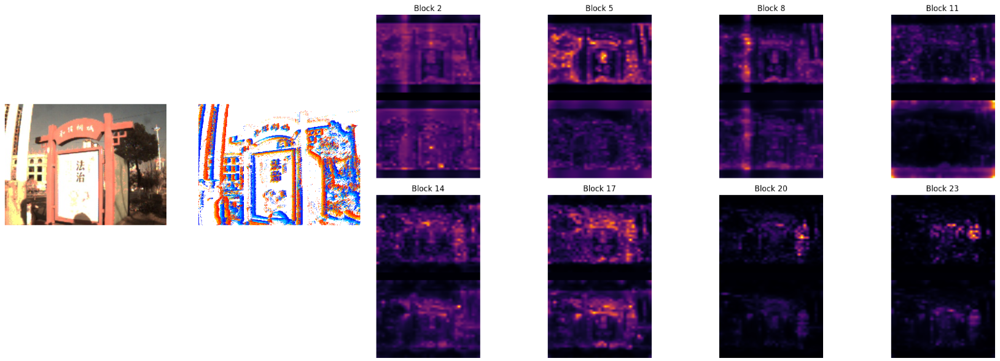
</td>
<td align="center">
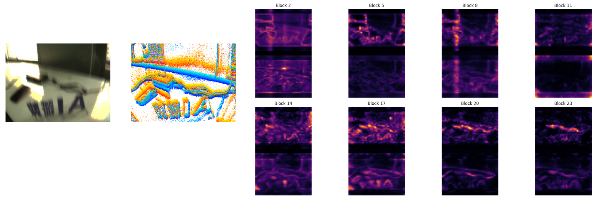
</td>
</tr>

At the same time, when the model is used for inference on the Objaverse validation set, the event encoder fails to extract features from a limited set of events:

<tr>
<td align="center">

</td>
<td align="center">

</td>
</tr>

This indicates that the event encoder is sensitive to the spatial distribution of events, and its expected variations should be covered by the training dataset.

## Conclusion

The primary limitation of this approach is the dependence on informative event streams. Small objects, objects with limited texture, or objects whose color blends with the background may fail to generate a sufficient number of events. Events should be captured at sufficiently high quality and at high temporal resolution in order to convert them to event images with sharp object edges.

To train a generalizable event encoder, one needs to generate a large synthetic dataset with highly varied events. The number and quality of events, alongside their spatial positioning, should be subject to strong randomization.

## Rendering Pipeline

A Blender-based rendering pipeline ([event_sam3d/rendering/](event_sam3d/rendering/)) generates training data from 3D object assets:

1. Circular camera trajectories are generated around objects with randomizable parameters
2. Synthetic events are generated via V2E from the rendered RGB sequences

## References

1. [SAM3D: Segment Anything in 3D Scenes](https://arxiv.org/abs/2306.03908)
2. [ShapeR: Robust Conditional 3D Shape Generation from Casual Captures](https://arxiv.org/abs/2601.11514)
3. [Segment Any Events via Weighted Adaptation of Pivotal Tokens](https://arxiv.org/abs/2312.16222)
4. [Flamingo: a Visual Language Model for Few-Shot Learning](https://arxiv.org/abs/2204.14198)
5. [v2e: From Video Frames to Realistic DVS Events](https://openaccess.thecvf.com/content/CVPR2021W/EventVision/papers/Hu_v2e_From_Video_Frames_to_Realistic_DVS_Events_CVPRW_2021_paper.pdf)
6. [Uni3D: Exploring Unified 3D Representation at Scale](https://arxiv.org/abs/2310.06773)
7. [Depth AnyEvent: A Cross-Modal Distillation Paradigm for Event-Based Monocular Depth Estimation](https://arxiv.org/abs/2509.15224)